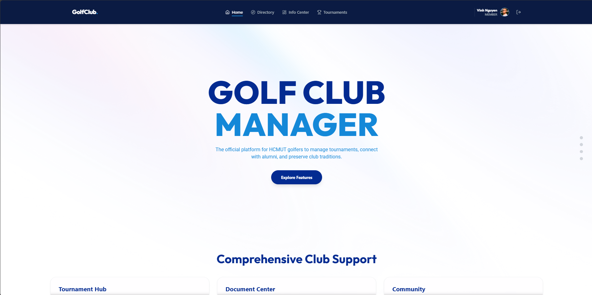
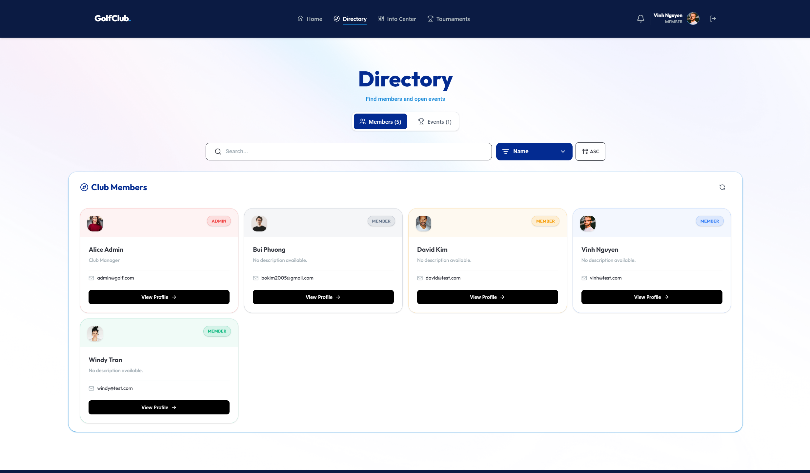
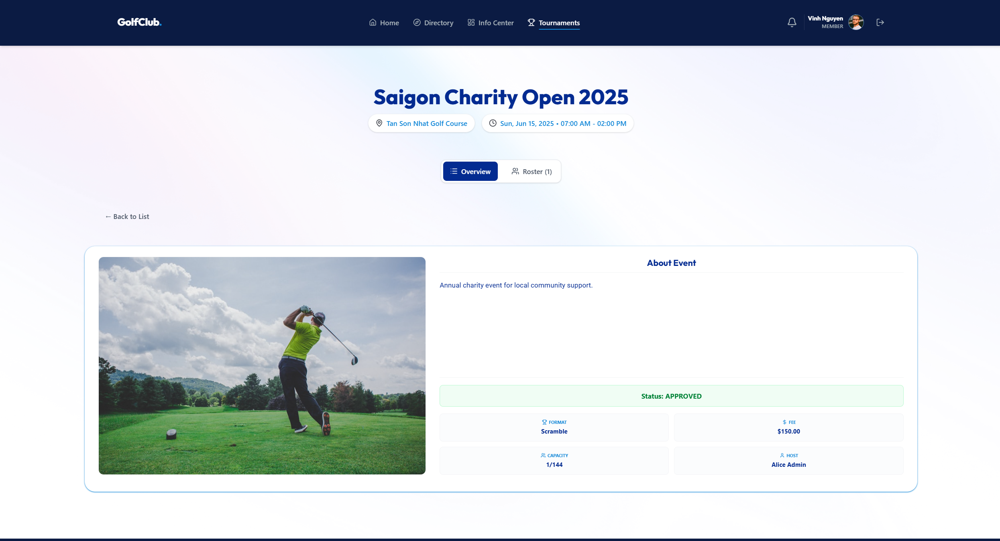
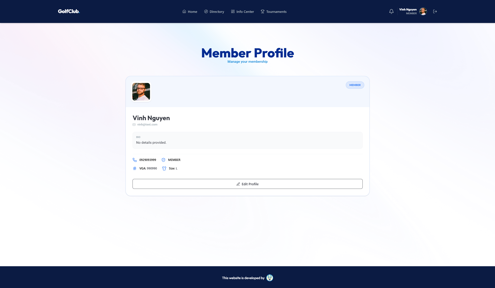

# ⛳ GOLF CULB MANAGER

## 🪟 Project Overview

Golf Club Manager is a comprehensive web-based management system designed to streamline operations and enhance member engagement within a golf club community. The application provides an integrated platform that connects club administrators and members through a unified digital ecosystem, enabling efficient tournament organization, member management, and communication.

The system addresses key challenges faced by modern golf clubs, including:

- Scattered management of tournament registrations and participant information

- Difficulty in organizing and publishing official club documents and announcements
  
- Limited accessibility for members to view club information and connect with other members
  
-  Complex membership approval workflows and administrative processes

## 🎯 Project Objectives

The primary objectives of Golf Club Manager are to:
- **Streamline Tournament Management** - Provide administrators with an intuitive platform to create, manage, and track golf tournaments with real-time participant registration and status monitoring.

- **Enhance Member Communication** - Enable seamless information dissemination through a centralized system for publishing documents, announcements, and notifications to club members.
- **Facilitate Member Networking** - Create a directory system that allows members to view profiles, connect with fellow golfers, and explore upcoming events.

- **Automate Administrative Workflows** - Simplify membership request processing, tournament application approvals, and role-based access control through automated procedures.

- **Improve Data Organization** - Maintain a structured, secure database with role-based permissions to ensure data integrity and privacy compliance.

## ⚙️ Technology Stack

- **Frontend:**

  - React 19.2 with Vite build tool

  - React Router DOM for navigation

  - Tailwind CSS for responsive design

  - Lucide React icons library

  - date-fns for date manipulation

- **Backend:**

  - Node.js with Express.js framework

  - MySQL database driver

  - JWT for authentication and authorization

  - bcryptjs for password encryption

  - CORS for cross-origin requests

- **Database:**

  - MySQL with stored procedures and triggers for business logic

  - Automatic timestamp management

  - Role-based data access control

## 💻 User Interface

### Homepage

### Members Directory

### Tournaments Hub

### User Profile 

